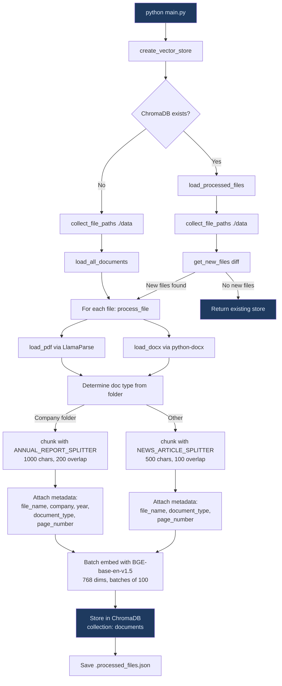
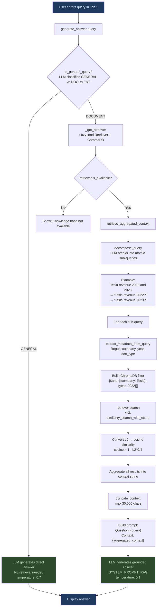
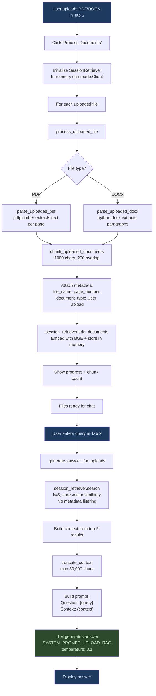

# DocIntel — Pipeline Documentation

Technical reference for the DocIntel RAG pipeline. Covers the full data flow from document ingestion to answer generation, for both the pre-loaded knowledge base and user-uploaded documents.

---

## Table of Contents

1. [Architecture Overview](#architecture-overview)
2. [Project Structure](#project-structure)
3. [Ingestion Pipeline (Pre-loaded KB)](#ingestion-pipeline-pre-loaded-kb)
4. [Flow 1: User Chatting with Knowledge Base](#flow-1-user-chatting-with-knowledge-base)
5. [Flow 2: User Chatting with Own Documents](#flow-2-user-chatting-with-own-documents)
6. [Component Details](#component-details)
7. [Configuration Reference](#configuration-reference)
8. [Deployment (Streamlit Cloud)](#deployment-streamlit-cloud)

---

## Architecture Overview

DocIntel has two independent RAG paths that share the same LLM and embedding model:

| | Knowledge Base (Tab 1) | Your Documents (Tab 2) |
|---|---|---|
| **Data source** | Pre-loaded PDFs (BMW, Ford, Tesla) | User-uploaded PDF/DOCX |
| **Vector store** | Persistent ChromaDB (`./chroma_db`) | In-memory ChromaDB (session-scoped) |
| **Parser** | LlamaParse (cloud API) | pdfplumber / python-docx (local) |
| **Collection** | `"documents"` | `"user_documents"` |
| **Retrieval** | Hybrid (metadata filter + vector) | Pure vector similarity |
| **Query processing** | Decomposition + metadata extraction | Direct search (no decomposition) |
| **Persistence** | Survives reboot (committed to git) | Lost when session ends |

---

## Project Structure

```
├── streamlit_app.py              # Main UI — two tabs (KB + Upload)
├── llm_config.py                 # LLM provider config (Gemini 2.5 Flash)
├── main.py                       # CLI entry point for ingestion
│
├── ingestion/                    # Document processing
│   ├── constants.py              # Paths, embedding model, chunk sizes
│   ├── ingest.py                 # Ingestion orchestrator (pre-loaded KB)
│   ├── utils.py                  # Loaders (LlamaParse, DOCX, TXT) + chunk creators
│   └── upload_processor.py       # User upload parser (pdfplumber, python-docx)
│
├── retrieval/                    # Query processing & vector search
│   ├── retriever.py              # Retriever class, query decomposition, metadata extraction
│   ├── session_retriever.py      # In-memory retriever for user uploads
│   └── utils.py                  # Metadata extraction utilities
│
├── generation/                   # LLM answer generation
│   └── generator.py              # Intent classifier + two generation paths
│
├── data/                         # Source PDFs (not on Streamlit Cloud)
│   ├── BMW/                      # 3 annual reports (2021-2023)
│   ├── Ford/                     # 3 annual reports (2021-2023)
│   ├── Tesla/                    # 2 annual reports (2022-2023)
│   └── News/                     # 1 news article
│
├── chroma_db/                    # Persistent vector store (committed to git)
│   ├── chroma.sqlite3            # SQLite database with embeddings
│   └── .processed_files.json     # Tracks which files have been ingested
│
├── requirements.txt              # Python dependencies
└── runtime.txt                   # Python version pin for Streamlit Cloud
```

---

## Ingestion Pipeline (Pre-loaded KB)

This runs locally via `python main.py` before deployment. It processes PDFs from `./data` into ChromaDB.



**Key functions:**

| Function | File | Purpose |
|---|---|---|
| `create_vector_store()` | `ingestion/ingest.py:216` | Main entry point — creates or updates ChromaDB |
| `process_file(path)` | `ingestion/ingest.py:151` | Load, detect type, chunk, attach metadata |
| `load_pdf(path)` | `ingestion/utils.py:28` | Parse PDF via LlamaParse (markdown output) |
| `chunk_documents(docs, config, creator)` | `ingestion/ingest.py:102` | Split text + apply metadata |
| `load_processed_files()` | `ingestion/ingest.py:53` | Read tracking JSON for deduplication |

**Metadata schema (Annual Report):**
```json
{
  "file_name": "Tesla_Annual_Report_2023.pdf",
  "document_type": "Annual Report",
  "company": "Tesla",
  "year": "2023",
  "page_number": 42
}
```

**Metadata schema (News Article):**
```json
{
  "file_name": "news.pdf",
  "document_type": "News Article",
  "page_number": 3
}
```

---

## Flow 1: User Chatting with Knowledge Base

This is the default tab. Queries go through intent classification, query decomposition, metadata-filtered retrieval, and grounded answer generation.



**Detailed step-by-step:**

1. **Intent Classification** (`generator.py:30`) — LLM receives the query with a system prompt that asks for a single word: `DOCUMENT` or `GENERAL`. Temperature 0.2 for deterministic output. On failure, defaults to DOCUMENT (safer).

2. **General Route** — If GENERAL, the LLM answers directly without any retrieval. Temperature 0.7 for natural conversation.

3. **Document Route** — If DOCUMENT:
   - **Query Decomposition** (`retriever.py:24`) — LLM breaks complex queries into atomic sub-questions using few-shot prompting. Example: "Compare BMW and Ford revenue over 3 years" becomes 6 separate queries.
   - **Metadata Extraction** (`retriever.py:66`) — Regex-based extraction of company names (BMW/Ford/Tesla), years (20XX pattern), and document type. Financial keywords trigger Annual Report preference.
   - **Hybrid Search** (`retriever.py:184`) — For each sub-query, ChromaDB filters by metadata first, then ranks by vector similarity (BGE embeddings). Returns top-3 per sub-query.
   - **Context Aggregation** (`retriever.py:235`) — All results merged into a single context string with document content and metadata.
   - **Answer Generation** (`generator.py:160`) — LLM receives the context with `SYSTEM_PROMPT_RAG` instructing it to answer ONLY from the provided context. Temperature 0.1 for factual precision.

---

## Flow 2: User Chatting with Own Documents

This is the "Your Documents" tab. Users upload files, which are parsed and embedded in a session-scoped in-memory vector store.



**Key differences from the KB flow:**

| Aspect | Knowledge Base (Tab 1) | User Uploads (Tab 2) |
|---|---|---|
| Intent classification | Yes (GENERAL vs DOCUMENT) | No (always searches docs) |
| Query decomposition | Yes (complex → atomic) | No (direct search) |
| Metadata filtering | Yes (company, year, type) | No (pure vector similarity) |
| Top-k per query | 3 per sub-query | 5 total |
| Parser | LlamaParse (cloud, high quality) | pdfplumber (local, good enough) |
| Storage | Persistent ChromaDB on disk | In-memory, session-scoped |
| Embeddings | BGE-base-en-v1.5 (shared) | BGE-base-en-v1.5 (shared) |

**Session lifecycle:**
- `SessionRetriever` is created when the user first clicks "Process Documents"
- Stored in `st.session_state.user_retriever`
- Survives Streamlit reruns within the same browser session
- Destroyed when the tab is closed or the user clicks "Clear uploads"
- Uses `@st.cache_resource` to share the BGE embedding model with the KB retriever (avoids loading 109 MB twice)

---

## Component Details

### LLM Configuration (`llm_config.py`)

```
Provider:     Google (Gemini)
Model:        gemini-2.5-flash
Endpoint:     https://generativelanguage.googleapis.com/v1beta/openai/
API Key:      GEMINI_API_KEY (from Streamlit secrets)
Client:       OpenAI SDK (compatible endpoint)
Timeout:      60 seconds
Context max:  30,000 characters
```

The app uses the OpenAI Python SDK pointed at Google's OpenAI-compatible endpoint. Switching providers requires changing only `LLM_BASE_URL`, `LLM_MODEL`, and `LLM_API_KEY` in `llm_config.py`.

### Embedding Model

```
Model:        BAAI/bge-base-en-v1.5
Dimensions:   768
Max tokens:   512
Size:         109 MB
Device:       CPU
Normalization: Enabled
```

### ChromaDB

```
Persistent store:   ./chroma_db/chroma.sqlite3
Collection name:    "documents" (KB), "user_documents" (uploads)
Distance metric:    L2 (converted to cosine: 1 - L2^2/4)
```

### System Prompts

| Prompt | Used for | Key instruction |
|---|---|---|
| `CLASSIFY_SYSTEM_PROMPT` | Intent classification | "Reply with DOCUMENT or GENERAL" |
| `SYSTEM_PROMPT_RAG` | KB answers | "Answer using ONLY the retrieved context. Do NOT fabricate facts." |
| `SYSTEM_PROMPT_UPLOAD_RAG` | Upload answers | "Answer using ONLY the retrieved context. Cite file name or page." |
| `SYSTEM_PROMPT_GENERAL` | General chat | Conversational assistant persona |

### LLM Temperature Settings

| Task | Temperature | Rationale |
|---|---|---|
| Intent classification | 0.2 | Near-deterministic single-word output |
| RAG answer generation | 0.1 | Factual, grounded in context |
| General conversation | 0.7 | Natural, creative responses |

---

## Configuration Reference

### `ingestion/constants.py`

| Constant | Value | Purpose |
|---|---|---|
| `DATA_PATH` | `./data` | Source document directory |
| `VECTOR_DB_PATH` | `./chroma_db` | ChromaDB persist directory |
| `PROCESSED_FILES_PATH` | `./chroma_db/.processed_files.json` | Ingestion tracking |
| `SUPPORTED_FILE_TYPES` | `.pdf, .docx, .txt` | Accepted file extensions |
| `EMBEDDING_MODEL_NAME` | `BAAI/bge-base-en-v1.5` | HuggingFace embedding model |
| `BATCH_SIZE` | `100` | Embedding batch size |
| `COMPANY_FOLDERS` | `BMW, Ford, Tesla` | Known company directories |
| `ANNUAL_REPORT_SPLITTER` | 1000 chars, 200 overlap | Chunk config for reports |
| `NEWS_ARTICLE_SPLITTER` | 500 chars, 100 overlap | Chunk config for news |

### `requirements.txt` key dependencies

| Package | Purpose |
|---|---|
| `streamlit` | Web UI framework |
| `openai` | LLM client (OpenAI-compatible, used for Gemini) |
| `chromadb` | Vector database |
| `langchain-chroma` | LangChain ChromaDB integration |
| `langchain-huggingface` | HuggingFace embeddings wrapper |
| `sentence-transformers` | BGE embedding model runtime |
| `pdfplumber` | PDF parsing for user uploads |
| `python-docx` | DOCX parsing for user uploads |
| `llama-parse` | PDF parsing for pre-loaded KB (cloud API) |
| `protobuf>=3.19.0,<5.0.0` | Pinned to avoid opentelemetry crash |

---

## Deployment (Streamlit Cloud)

### Secrets required

```toml
GEMINI_API_KEY = "your-gemini-api-key"
```

### Settings

- **Python version**: 3.11 (set in Advanced Settings, NOT via runtime.txt)
- **Main file**: `streamlit_app.py`
- **Repository**: GitHub repo with `chroma_db/` committed

### How it works on Streamlit Cloud

1. Streamlit Cloud clones the repo (includes `chroma_db/` with pre-built embeddings)
2. Installs `requirements.txt` dependencies
3. Runs `streamlit_app.py`
4. The `Retriever` class loads ChromaDB from `./chroma_db` on first query (lazy init)
5. User uploads create in-memory ChromaDB collections (ephemeral, no disk writes needed)
6. On reboot/redeploy, the repo is re-cloned — pre-loaded KB is intact, user uploads are gone

### Adding new documents to the KB

1. Place PDFs in `./data/<Company>/` locally
2. Run `python main.py` to process and embed
3. Commit updated `chroma_db/` and `data/` to git
4. Push to GitHub — Streamlit Cloud redeploys automatically
